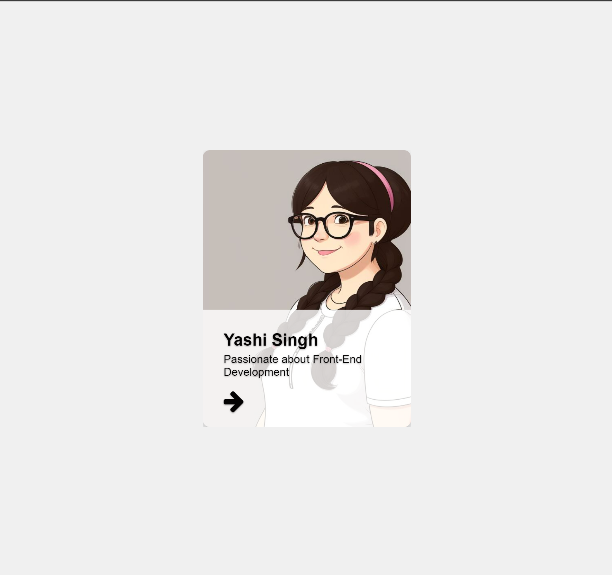
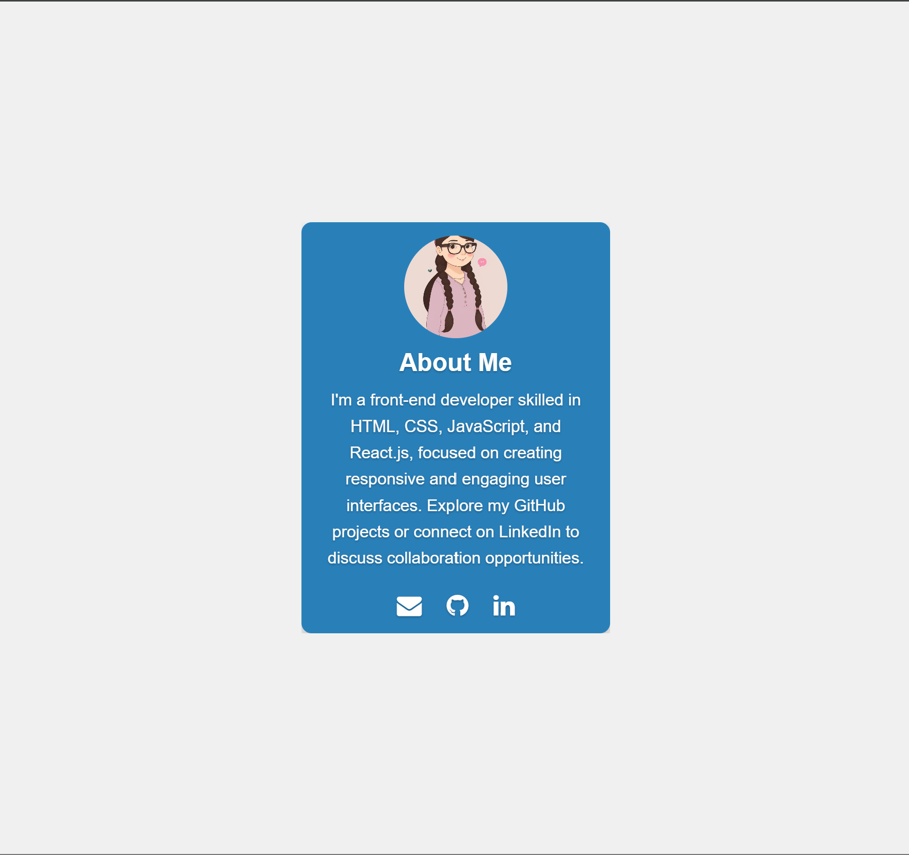

<h1>CSS Flip Card Challenge</h1>

<h2>Overview</h2>

The CSS Flip Card challenge involves creating an interactive flip card using HTML and CSS. This project demonstrates proficiency in CSS styling to create an engaging user interface with a flip animation that reveals additional information on hover.

<h2>Table of Contents</h2>
<ul>
    <li><a href="#objective">Objective</a></li>
    <li><a href="#requirements">Requirements</a></li>
    <li><a href="#preview">Preview</a></li>
    <li><a href="#installation">Installation</a></li>
    <li><a href="#usage">Usage</a></li>
    <li><a href="#project-structure">Project Structure</a></li>
    <li><a href="#styling">Styling</a></li>
    <li><a href="#challenges">Challenges</a></li>
    <li><a href="#contributing">Contributing</a></li>
    <li><a href="#contact">Contact</a></li>
</ul>

<h2 id="objective">Objective</h2>

The objective of this project is to create an interactive CSS flip card that demonstrates skills in HTML, CSS, and possibly JavaScript (if required). The flip card should have two sides: a front side displaying basic information and a back side revealing additional details when hovered or clicked.

<h2 id="requirements">Requirements</h2>

To complete this challenge, you will need:

<ul>
    <li>Basic knowledge of HTML and CSS</li>
    <li>Understanding of CSS transitions and animations</li>
    <li>Optional: familiarity with JavaScript for additional interactive features</li>
</ul>

<h2 id="preview">Preview</h2>

Here is a preview of what the CSS flip card should look like:

<h2 id="installation">Installation</h2>

To install and run this project locally, follow these steps:

<pre>
    <code>
        git clone https://github.com/Yashi-Singh-1/Day-05-CSS-Flip-Card.git
        cd Day-05-CSS-Flip-Card
        open index.html
    </code>
</pre>

<h2 id="usage">Usage</h2>

To use the CSS flip card in your own project:

<ol>
    <li>Include the necessary HTML structure in your file.</li>
    <li>Link the CSS styles to your HTML file.</li>
    <li>Adjust the content and styling as per your requirements.</li>
</ol>

<h2 id="project-structure">Project Structure</h2>

The project is structured as follows:

<pre>
    <code>
        index.html
        styles.css
        image/
            profile-card.jpeg
            profile-card-1.jpeg
    </code>
</pre>

<h2 id="styling">Styling</h2>

The flip card is styled using CSS. Here are some key styling points:

<ul>
    <li>Positioning elements using flexbox and absolute positioning.</li>
    <li>Applying transitions for smooth animations.</li>
    <li>Using `transform` property for 3D effects.</li>
    <li>Styling hover effects and transitions.</li>
</ul>

<h2 id="challenges">Challenges</h2>

The main challenges faced during this project include:

<ul>
    <li>Ensuring cross-browser compatibility.</li>
    <li>Adjusting the flip animation timing and smoothness.</li>
    <li>Creating responsive designs that work well on different screen sizes.</li>
</ul>

<h2 id="contributing">Contributing</h2>

Contributions are welcome! Follow these steps to contribute:

<ol>
    <li>Fork the repository.</li>
    <li>Create a new branch (`git checkout -b feature`).</li>
    <li>Make your changes.</li>
    <li>Commit your changes (`git commit -am 'Add feature'`).</li>
    <li>Push to the branch (`git push origin feature`).</li>
    <li>Create a new Pull Request.</li>
</ol>

<h2 id="contact">Contact</h2>

For any inquiries or suggestions, feel free to contact me:

<ul>
    <li>Email: yashuchoudhary575@gmail.com</li>
    <li>LinkedIn: Yashi Singh <a href="https://www.linkedin.com/in/yashi-singh-b4143a246">https://www.linkedin.com/in/yashi-singh-b4143a246</a></li>
    <li>GitHub: <a href="https://github.com/Yashi-Singh-1">Yashi-Singh-1</a></li>
</ul>